<h1>DAMH_N19DCCN112_N19DCCN231</h1>
<h2>Đồ án môn học cô Nguyễn Thị Tuyết Hải PTITHCM</h2>
<h3>Sinh viên</h3>
<h4>SV1: N19DCCN112 - Nguyễn Thị Huỳnh My - D19CQCN02-N 
SV2: N19DCCN231 - Trần Thùy Vy - D19CQCN02-N</h4>

<h5>Học kì I năm học 2021 - 2022</h5>

<h2>Nội dung: Trò chơi khủng long chạy bộ (Dinosaur run)

<h2>Demo 
 
 

<h2> Hướng dẫn sử dụng source code </h2>
Bước 1: Mở trình duyệt web => Download Python: https://www.python.org/downloads/ 
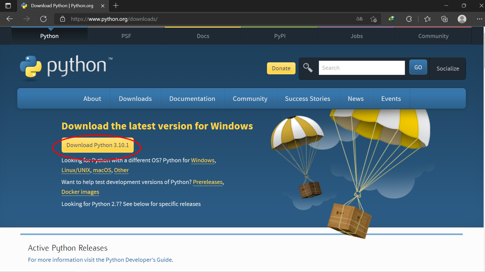 
Bước 2: Vào folder chứa file vừa download => Tiến hành cài đặt Python
Bước 3: Search Python từ thanh tìm kiếm => Open file location  
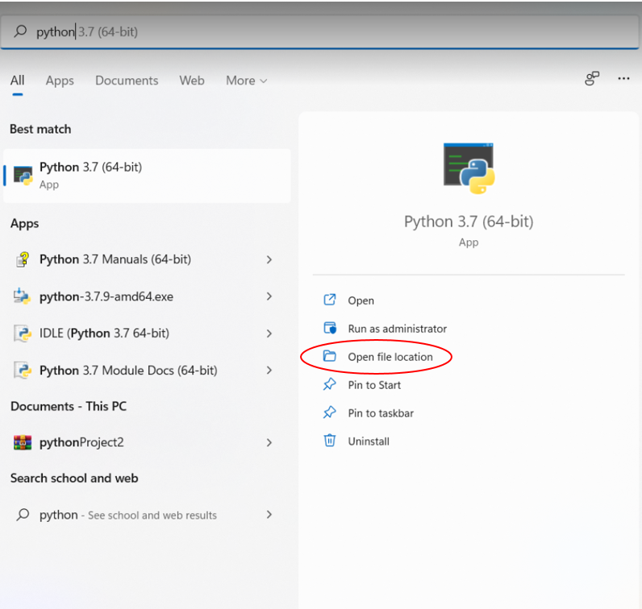 
Bước 4: Một folder xuất hiện => chuột phải vào python => Open file location  
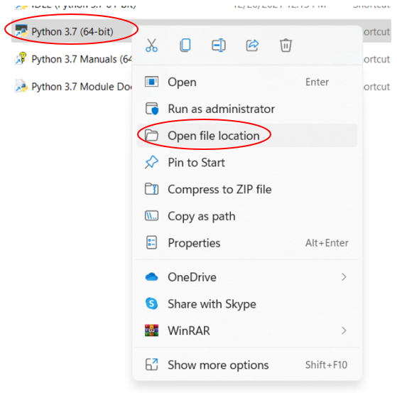 
Bước 5: Sao chép địa chỉ nơi chứa Python  
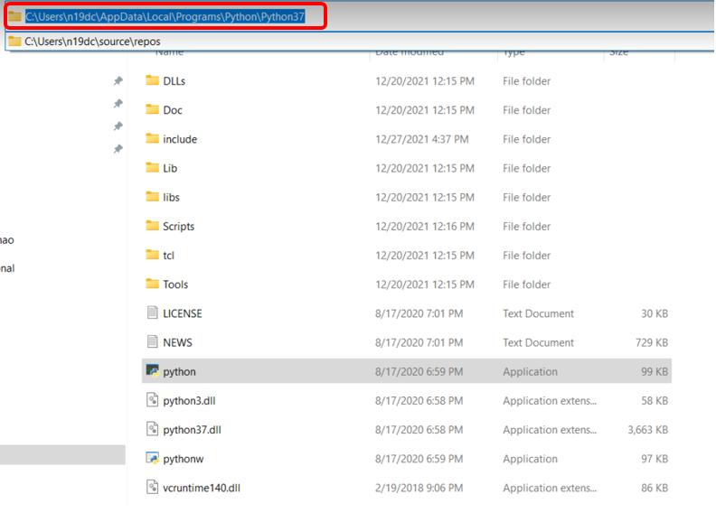 
Bước 6: Set Path cho Python  
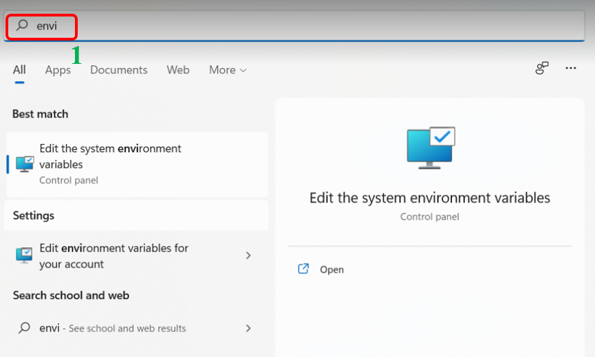 
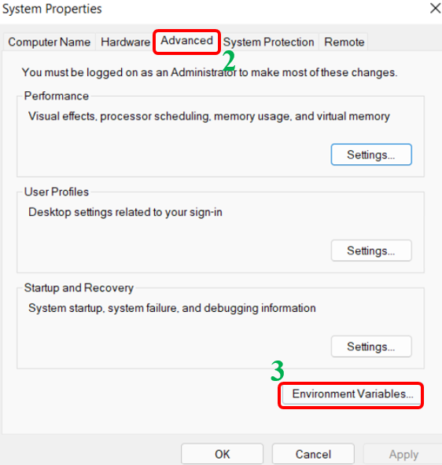 
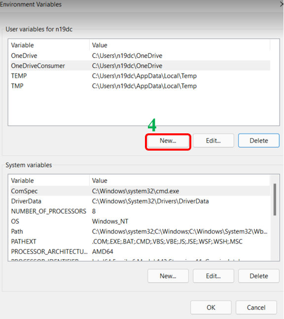 
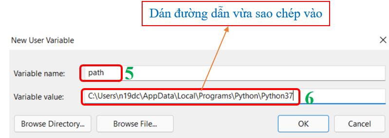 
Bước 7: Tải code từ github về và sử dụng code: https://github.com/thuyvy-ttv-rae/DAMH_N19DCCN112_N19DCCN231  
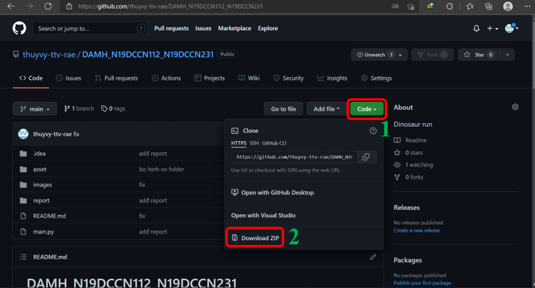 
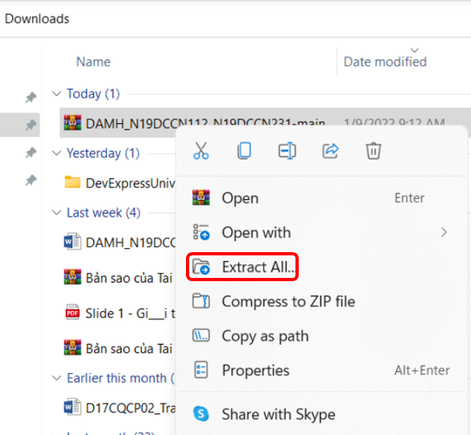 
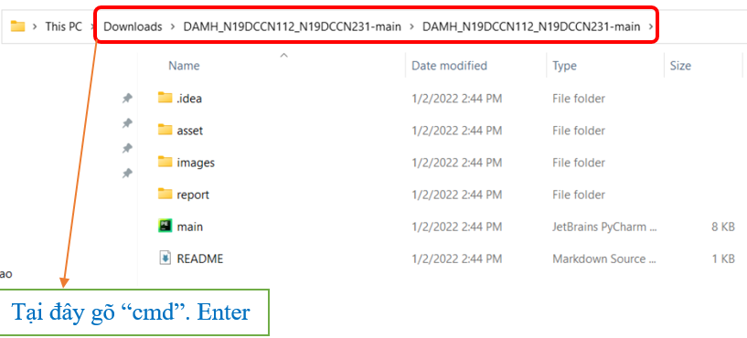 
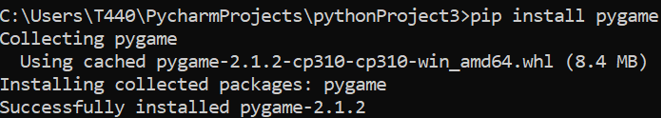 
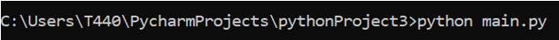 
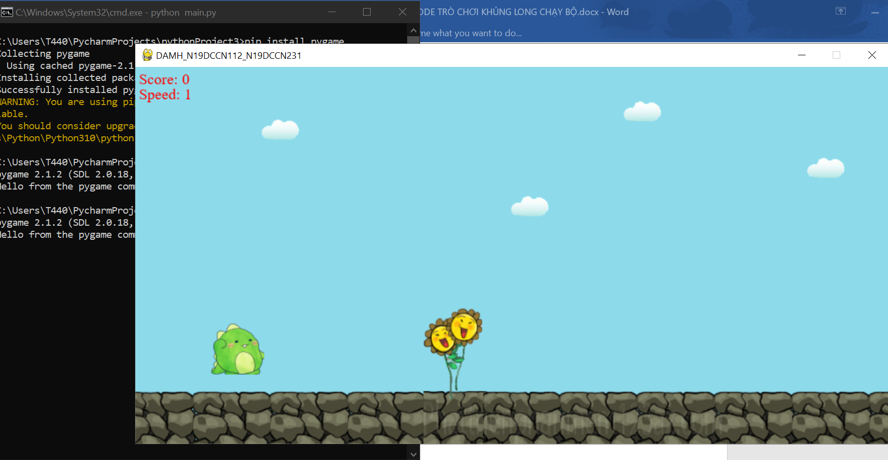 

